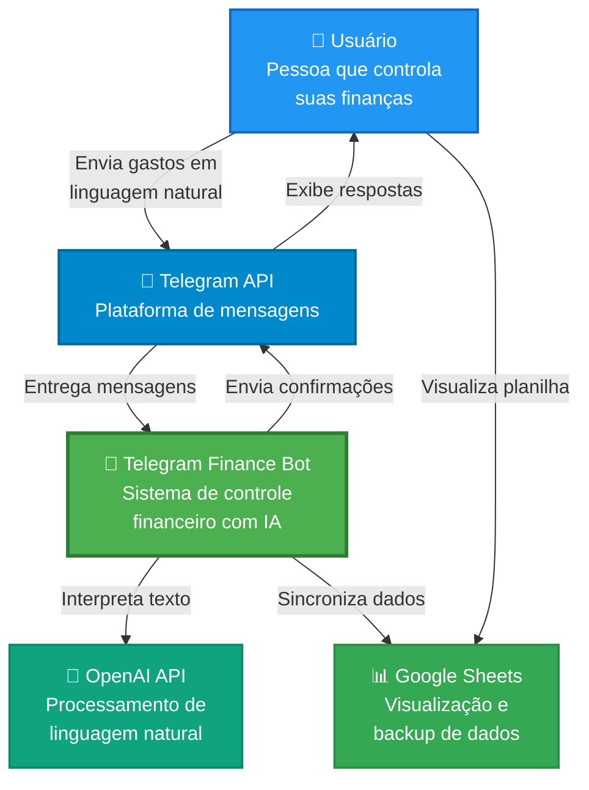
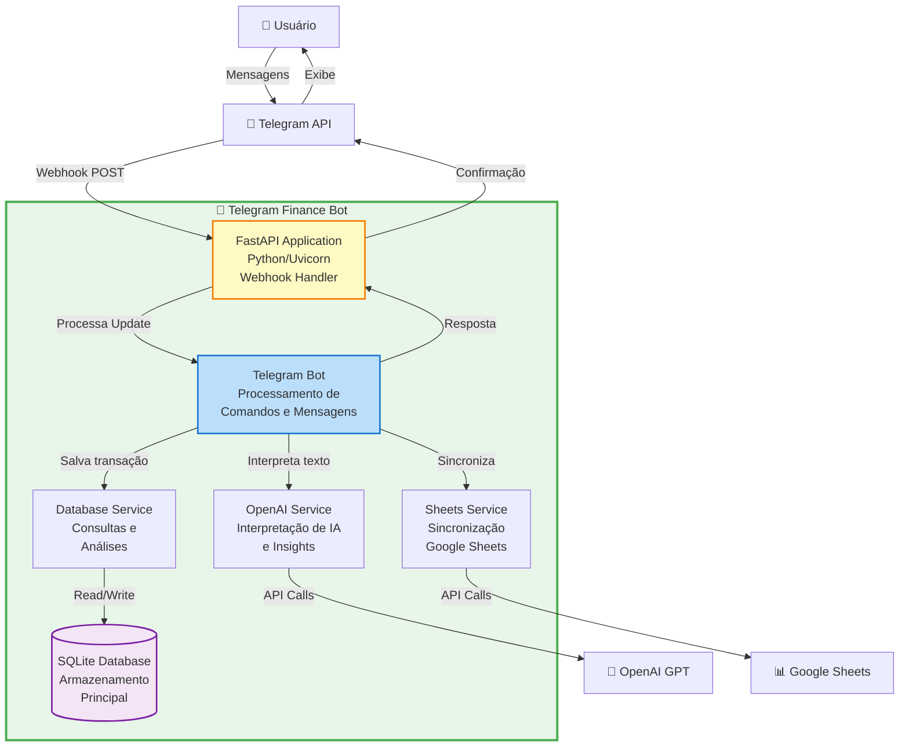
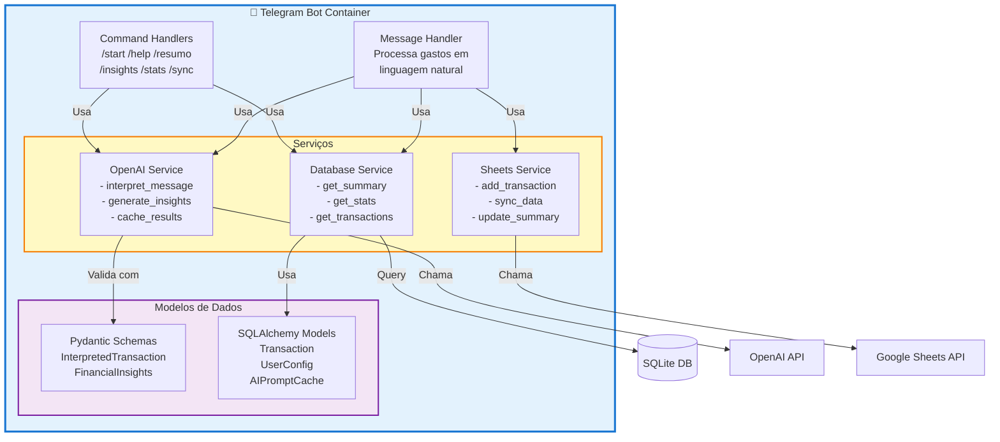

# 🤖 Telegram Finance Bot

Bot inteligente de controle financeiro pessoal via Telegram com IA, que interpreta mensagens em linguagem natural e organiza seus gastos automaticamente.

## 📋 Índice

- [Quick Start](#-quick-start)
- [Sobre o Projeto](#-sobre-o-projeto)
- [Funcionalidades](#-funcionalidades)
- [Como Funciona](#-como-funciona)
  - [Diagramas C4](#diagramas-c4)
- [Pré-requisitos](#-pré-requisitos)
- [Configuração](#️-configuração)
  - [1. Telegram Bot](#1-telegram-bot)
  - [2. OpenAI API](#2-openai-api)
  - [3. Google Sheets](#3-google-sheets)
  - [4. Variáveis de Ambiente](#4-variáveis-de-ambiente)
- [Instalação](#-instalação)
- [Como Rodar](#️-como-rodar)
- [Uso do Bot](#-uso-do-bot)
- [Scripts Auxiliares](#-scripts-auxiliares)
- [Estrutura do Projeto](#-estrutura-do-projeto)
- [Testes](#-testes)
- [Tecnologias](#️-tecnologias)

---

## 🚀 Quick Start

**Para Linux/Mac:**

```bash
# 1. Clone e entre no diretório
git clone https://github.com/seu-usuario/telegram-finance-bot.git
cd telegram-finance-bot

# 2. Execute o setup automático
chmod +x setup.sh
./setup.sh

# 3. Configure suas credenciais
# - Edite o arquivo .env com suas chaves
# - Coloque google_service_account.json em credentials/

# 4. Rode o bot
chmod +x run_dev.sh
./run_dev.sh
```

**Para Windows:**

```bash
# 1. Clone e entre no diretório
git clone https://github.com/seu-usuario/telegram-finance-bot.git
cd telegram-finance-bot

# 2. Crie ambiente virtual e instale dependências
python -m venv .venv
.venv\Scripts\activate
pip install -r requirements.txt

# 3. Configure
copy .env.example .env
mkdir logs
mkdir credentials
# - Edite o arquivo .env com suas chaves
# - Coloque google_service_account.json em credentials/

# 4. Rode o bot
python main.py
```

**Precisa de ajuda para obter as credenciais?** Veja a seção [Configuração](#️-configuração) abaixo.

---

## 🎯 Sobre o Projeto

O **Telegram Finance Bot** é um assistente financeiro pessoal que utiliza inteligência artificial para interpretar suas mensagens sobre gastos em linguagem natural e organizá-las automaticamente em categorias.

**Principais diferenciais:**
- 🧠 **IA para interpretação**: Usa GPT para entender mensagens como "gastei 50 reais no supermercado"
- 📊 **Sincronização automática**: Salva dados no SQLite e sincroniza com Google Sheets
- 💡 **Insights inteligentes**: Gera análises financeiras personalizadas com IA
- 🏷️ **Categorização automática**: Identifica automaticamente a categoria do gasto
- 📅 **Inferência de datas**: Entende expressões como "ontem", "semana passada"
- 💰 **Suporte a investimentos**: Categoria especial "Finanças" para poupança e investimentos

---

## ✨ Funcionalidades

### Comandos Disponíveis

- `/start` - Iniciar o bot e ver menu principal
- `/help` - Ajuda completa com exemplos
- `/resumo` - Resumo do mês atual
- `/resumo [mês]` - Resumo de mês específico (ex: `/resumo janeiro`)
- `/resumo ano` - Resumo anual completo
- `/insights` - Análise financeira com IA do mês atual
- `/insights ano` - Análise anual completa com IA
- `/stats` - Estatísticas detalhadas do banco de dados
- `/sync` - Sincronizar dados com Google Sheets
- `/sync clean` - Limpar dados inconsistentes na planilha
- `/categoria` - Ver todas as categorias disponíveis
- `/config` - Ver configurações do sistema

### Categorias Automáticas

- 🍔 **Alimentação** - Supermercado, restaurante, padaria
- 🚗 **Transporte** - Uber, combustível, ônibus
- 💊 **Saúde** - Farmácia, consultas, exames
- 🎬 **Lazer** - Cinema, shows, viagens
- 🏠 **Casa** - Contas, limpeza, manutenção
- 💰 **Finanças** - Investimentos, poupança, aplicações
- 📦 **Outros** - Demais gastos

---

## 🔄 Como Funciona

### Fluxo de Processamento

```
1. Usuário envia mensagem
   ↓
2. Bot recebe via Telegram API
   ↓
3. OpenAI interpreta a mensagem
   ↓
4. Extrai: descrição, valor, categoria, data
   ↓
5. Salva no banco SQLite (fonte principal)
   ↓
6. Sincroniza com Google Sheets (visualização)
   ↓
7. Retorna confirmação ao usuário
```

### Diagramas C4

#### Nível 1: Diagrama de Contexto



#### Nível 2: Diagrama de Contêineres



#### Nível 3: Diagrama de Componentes (Bot)



### Exemplo de Uso

```
Você: "gastei 45 reais no uber ontem"

Bot: ✅ Gasto registrado com sucesso!
     🚗 Uber
     Valor: R$ 45.00
     Categoria: Transporte
     Data: 08/11/2025
     Confiança: 95%
```

### Arquitetura

O sistema segue uma arquitetura em camadas com separação clara de responsabilidades:

**Camada de Apresentação:**
- **Telegram Bot API**: Interface com o usuário via mensagens
- **FastAPI**: Servidor web para receber webhooks

**Camada de Aplicação:**
- **Bot Handler**: Processa comandos e mensagens
- **Services**: Lógica de negócio (OpenAI, Sheets, Database)

**Camada de Dados:**
- **SQLite**: Banco de dados principal (fonte da verdade)
- **Google Sheets**: Visualização e backup
- **Cache**: Otimização de chamadas à IA

**Integrações Externas:**
- **OpenAI GPT**: Interpretação de linguagem natural e insights
- **Google Sheets API**: Sincronização de dados
- **Telegram Bot API**: Comunicação com usuários

**Princípios Arquiteturais:**
- ✅ Single Source of Truth (SQLite)
- ✅ Separation of Concerns (Services isolados)
- ✅ Dependency Injection (Pydantic Settings)
- ✅ Async/Await (Performance otimizada)
- ✅ Cache Strategy (Redução de custos com IA)

---

## 📦 Pré-requisitos

- Python 3.9+
- Conta no Telegram
- Conta OpenAI com créditos
- Conta Google (para Google Sheets)

---

## ⚙️ Configuração

### 1. Telegram Bot

1. Abra o Telegram e procure por `@BotFather`
2. Envie `/newbot` e siga as instruções
3. Escolha um nome e username para seu bot
4. Copie o **token** fornecido (formato: `123456789:ABCdefGHIjklMNOpqrsTUVwxyz`)


### 2. OpenAI API

1. Acesse [platform.openai.com](https://platform.openai.com)
2. Faça login ou crie uma conta
3. Vá em **API Keys** no menu lateral
4. Clique em **Create new secret key**
5. Copie a chave (formato: `sk-...`)
6. Adicione créditos na sua conta (mínimo $5)

**Modelos recomendados:**
- `gpt-3.5-turbo` - Mais barato, rápido (recomendado)
- `gpt-4` - Mais preciso, mais caro

### 3. Google Sheets

#### 3.1. Criar Service Account

1. Acesse [Google Cloud Console](https://console.cloud.google.com)
2. Crie um novo projeto ou selecione um existente
3. Ative a **Google Sheets API**:
   - Menu → APIs & Services → Library
   - Procure "Google Sheets API"
   - Clique em "Enable"

4. Crie uma Service Account:
   - Menu → APIs & Services → Credentials
   - Create Credentials → Service Account
   - Preencha nome e descrição
   - Clique em "Create and Continue"
   - Role: Editor
   - Clique em "Done"

5. Gere a chave JSON:
   - Clique na service account criada
   - Aba "Keys"
   - Add Key → Create new key
   - Tipo: JSON
   - Baixe o arquivo

6. Renomeie o arquivo para `google_service_account.json`
7. Mova para a pasta `credentials/` do projeto

#### 3.2. Criar e Configurar Planilha

1. Acesse [Google Sheets](https://sheets.google.com)
2. Crie uma nova planilha
3. Copie o **ID da planilha** da URL:
   ```
   https://docs.google.com/spreadsheets/d/[ID_AQUI]/edit
   ```

4. Compartilhe a planilha:
   - Clique em "Compartilhar"
   - Cole o email da service account (está no arquivo JSON: `client_email`)
   - Permissão: Editor
   - Enviar

**Estrutura automática:**
O bot criará automaticamente as seguintes abas:
- Janeiro, Fevereiro, ..., Dezembro (uma para cada mês)
- Resumo (totalizadores automáticos)

### 4. Variáveis de Ambiente

1. Copie o arquivo de exemplo:
```bash
cp .env.example .env
```

2. Edite o arquivo `.env` com suas credenciais:

```bash
# Telegram Bot Configuration
TELEGRAM_BOT_TOKEN=123456789:ABCdefGHIjklMNOpqrsTUVwxyz
TELEGRAM_WEBHOOK_URL=https://seu-dominio.com/webhook

# OpenAI Configuration
OPENAI_API_KEY=sk-proj-xxxxxxxxxxxxxxxxxxxxxxxx
OPENAI_MODEL=gpt-3.5-turbo

# Google Sheets Configuration
GOOGLE_SHEETS_SPREADSHEET_ID=1a2b3c4d5e6f7g8h9i0j
GOOGLE_CREDENTIALS_FILE=credentials/google_service_account.json

# Database Configuration
DATABASE_URL=sqlite:///./finance_bot.db

# Application Configuration
APP_NAME=Telegram Finance Bot
DEBUG=True
LOG_LEVEL=INFO

# Categories (comma separated)
DEFAULT_CATEGORIES=Alimentação,Transporte,Saúde,Lazer,Casa,Finanças,Outros
```

---

## 🚀 Instalação

### Opção 1: Instalação Local (Linux/Mac)

1. Clone o repositório:
```bash
git clone https://github.com/seu-usuario/telegram-finance-bot.git
cd telegram-finance-bot
```

2. Execute o script de setup:
```bash
chmod +x setup.sh
./setup.sh
```

O script irá automaticamente:
- ✅ Criar ambiente virtual Python
- ✅ Instalar todas as dependências
- ✅ Criar diretórios necessários (logs, credentials)
- ✅ Copiar arquivo `.env.example` para `.env`

3. Configure suas credenciais:
   - Edite o arquivo `.env` com suas chaves
   - Coloque o arquivo `google_service_account.json` na pasta `credentials/`

### Opção 1b: Instalação Manual (Windows)

1. Clone o repositório:
```bash
git clone https://github.com/seu-usuario/telegram-finance-bot.git
cd telegram-finance-bot
```

2. Crie um ambiente virtual:
```bash
python -m venv .venv
.venv\Scripts\activate
```

3. Instale as dependências:
```bash
pip install --upgrade pip
pip install -r requirements.txt
```

4. Crie as pastas necessárias:
```bash
mkdir logs
mkdir credentials
```

5. Configure o arquivo `.env`:
```bash
copy .env.example .env
```

6. Coloque o arquivo `google_service_account.json` na pasta `credentials/`

### Opção 2: Docker (Recomendado para Produção)

1. Configure o arquivo `.env` (mesmo processo acima)

2. Build e execute:
```bash
# Build da imagem
docker-compose build

# Rodar o container
docker-compose up -d
```

**Nota:** Os scripts `setup.sh` e `run_dev.sh` facilitam muito o processo de instalação e execução em ambientes Linux/Mac, automatizando validações e configurações!

---

## ▶️ Como Rodar

### Modo Desenvolvimento (Linux/Mac)

Use o script de desenvolvimento que já ativa o ambiente virtual e valida as configurações:

```bash
chmod +x run_dev.sh
./run_dev.sh
```

O script irá:
- ✅ Ativar o ambiente virtual automaticamente
- ✅ Verificar se o arquivo `.env` existe
- ✅ Verificar se as credenciais Google estão configuradas
- ✅ Iniciar o servidor com reload automático

### Modo Desenvolvimento (Windows)

```bash
# Ativar ambiente virtual
.venv\Scripts\activate

# Rodar aplicação
python main.py
```

O servidor estará disponível em: `http://localhost:8000`

### Modo Produção (Docker)

```bash
docker-compose up -d
```

### Verificar Status

```bash
# Health check
curl http://localhost:8000/health

# Logs
docker-compose logs -f  # Docker
# ou
tail -f logs/app.log  # Local
```

---

## 💬 Uso do Bot

### Exemplos de Mensagens

O bot entende linguagem natural. Exemplos:

**Gastos regulares:**
```
"gastei 25 reais no supermercado"
"uber 15 reais"
"almoço no restaurante 45 reais ontem"
"farmácia remédio 30 reais"
"cinema 40 reais sábado passado"
```

**Investimentos e poupança:**
```
"guardei 300 reais na poupança"
"investi 500 reais"
"aplicação de 200 reais"
"reserva de emergência 1000 reais"
```

**Comandos de relatório:**
```
/resumo              → Resumo do mês atual
/resumo janeiro      → Resumo de janeiro
/resumo ano          → Resumo anual
/insights            → Análise IA do mês
/insights ano        → Análise IA anual
/stats               → Estatísticas do banco
```

### Resposta do Bot

```
✅ Gasto registrado com sucesso!

🍔 Supermercado
Valor: R$ 25.00
Categoria: Alimentação
Data: 09/11/2025

Confiança: 95%
ID: #123

Salvo na planilha Google! Use /resumo para ver totais.
```

---

## 📁 Estrutura do Projeto

```
telegram-finance-bot/
├── bot/                          # Bot do Telegram
│   ├── __init__.py
│   └── telegram_bot.py          # Lógica principal do bot
├── config/                       # Configurações
│   ├── __init__.py
│   ├── settings.py              # Variáveis de ambiente
│   └── logging_config.py        # Configuração de logs
├── database/                     # Banco de dados
│   ├── __init__.py
│   ├── sqlite_db.py             # Conexão SQLite
│   └── models.py                # Modelos SQLAlchemy
├── models/                       # Schemas Pydantic
│   ├── __init__.py
│   └── schemas.py               # Modelos de dados
├── services/                     # Serviços externos
│   ├── __init__.py
│   ├── openai_service.py        # Integração OpenAI
│   ├── sheets_service.py        # Integração Google Sheets
│   └── database_service.py      # Queries do banco
├── utils/                        # Utilitários
│   ├── __init__.py
│   └── helpers.py               # Funções auxiliares
├── tests/                        # Testes
│   ├── __init__.py
│   ├── test_basic.py            # Testes unitários
│   └── test_integration.py      # Testes de integração
├── credentials/                  # Credenciais (não versionado)
│   └── google_service_account.json
├── logs/                         # Logs da aplicação
├── .env                          # Variáveis de ambiente (não versionado)
├── .env.example                  # Exemplo de .env
├── main.py                       # Ponto de entrada
├── requirements.txt              # Dependências Python
├── setup.sh                      # Script de instalação (Linux/Mac)
├── run_dev.sh                    # Script para rodar em dev (Linux/Mac)
├── Dockerfile                    # Imagem Docker
├── docker-compose.yml            # Orquestração Docker
└── README.md                     # Este arquivo
```

---

## 🔧 Scripts Auxiliares

### `setup.sh` (Linux/Mac)

Script de configuração inicial que automatiza todo o processo de instalação:

```bash
chmod +x setup.sh
./setup.sh
```

**O que o script faz:**
- ✅ Cria ambiente virtual Python (`.venv`)
- ✅ Atualiza o pip para última versão
- ✅ Instala todas as dependências do `requirements.txt`
- ✅ Cria diretórios necessários (`logs/`, `credentials/`)
- ✅ Copia `.env.example` para `.env` (se não existir)
- ✅ Exibe links úteis para obter credenciais

### `run_dev.sh` (Linux/Mac)

Script para rodar o bot em modo desenvolvimento com validações:

```bash
chmod +x run_dev.sh
./run_dev.sh
```

**O que o script faz:**
- ✅ Verifica se o ambiente virtual existe
- ✅ Ativa o ambiente virtual automaticamente
- ✅ Valida se o arquivo `.env` está configurado
- ✅ Alerta se as credenciais Google não foram encontradas
- ✅ Inicia a aplicação com `python main.py`

**Vantagens dos scripts:**
- 🚀 Setup em um único comando
- 🔍 Validações automáticas de configuração
- ⚡ Economia de tempo e redução de erros
- 📝 Mensagens claras sobre o que está acontecendo

---

## 🧪 Testes

### Rodar todos os testes

```bash
pytest -v
```

### Rodar testes específicos

```bash
# Testes unitários
pytest tests/test_basic.py -v

# Testes de integração
pytest tests/test_integration.py -v

# Teste específico
pytest tests/test_basic.py::TestSchemas::test_interpreted_transaction_creation -v
```

### Cobertura de testes

```bash
pytest --cov=. --cov-report=html
```

---

## 🛠️ Tecnologias

### Backend
- **FastAPI** - Framework web moderno e rápido
- **Python Telegram Bot** - SDK oficial do Telegram
- **SQLAlchemy** - ORM para banco de dados
- **Pydantic** - Validação de dados

### IA e Processamento
- **OpenAI GPT** - Interpretação de linguagem natural
- **Loguru** - Logging avançado

### Armazenamento
- **SQLite** - Banco de dados principal (local, rápido)
- **Google Sheets API** - Sincronização e visualização

### DevOps
- **Docker** - Containerização
- **Uvicorn** - Servidor ASGI
- **Pytest** - Framework de testes

---

## 📊 Exemplo de Planilha Google Sheets

O bot cria automaticamente a seguinte estrutura:

**Aba "Janeiro":**
| ID  | Data       | Descrição    | Categoria    | Valor  | Observações    |
|-----|------------|--------------|--------------|--------|----------------|
| 1   | 15/01/2025 | Supermercado | Alimentação  | 150.00 | Confiança: 95% |
| 2   | 16/01/2025 | Uber         | Transporte   | 25.00  | Confiança: 98% |
| 3   | 17/01/2025 | Poupança     | Finanças     | 500.00 | Confiança: 99% |

**Aba "Resumo":**
| Mês      | Total Gastos | Alimentação | Transporte | Saúde | Lazer | Casa | Finanças | Outros | Transações |
|----------|--------------|-------------|------------|-------|-------|------|----------|--------|------------|
| Janeiro  | 175.00       | 150.00      | 25.00      | 0.00  | 0.00  | 0.00 | 500.00   | 0.00   | 3          |
| Fevereiro| 0.00         | 0.00        | 0.00       | 0.00  | 0.00  | 0.00 | 0.00     | 0.00   | 0          |

---

## 🔒 Segurança

- ✅ Credenciais em variáveis de ambiente
- ✅ Arquivo `.env` não versionado
- ✅ Service Account com permissões mínimas
- ✅ Validação de dados com Pydantic
- ✅ Logs estruturados sem dados sensíveis

---

## 🐛 Troubleshooting

### Erro: "permission denied" ao executar scripts
**Linux/Mac:**
```bash
chmod +x setup.sh run_dev.sh
```

### Erro: "Bot not initialized"
- Verifique se o token do Telegram está correto no `.env`
- Confirme que o bot está ativo no BotFather
- Teste o token: `curl https://api.telegram.org/bot<SEU_TOKEN>/getMe`

### Erro: "OpenAI API key invalid"
- Verifique se a chave está correta no `.env`
- Confirme que há créditos na conta OpenAI
- Teste a chave em: https://platform.openai.com/api-keys

### Erro: "Permission denied" no Google Sheets
- Verifique se compartilhou a planilha com o email da service account
- Confirme que a permissão é "Editor"
- O email está no arquivo JSON: campo `client_email`

### Erro: "Module not found"
**Linux/Mac:**
```bash
source .venv/bin/activate
pip install -r requirements.txt
```
**Windows:**
```bash
.venv\Scripts\activate
pip install -r requirements.txt
```

### Erro: "Ambiente virtual não encontrado"
Execute o setup novamente:
```bash
./setup.sh  # Linux/Mac
# ou siga os passos manuais para Windows
```

### Testes falhando
- Verifique se o arquivo `.env` está configurado
- Rode: `pytest -v --tb=short` para ver detalhes
- Certifique-se de que o ambiente virtual está ativo